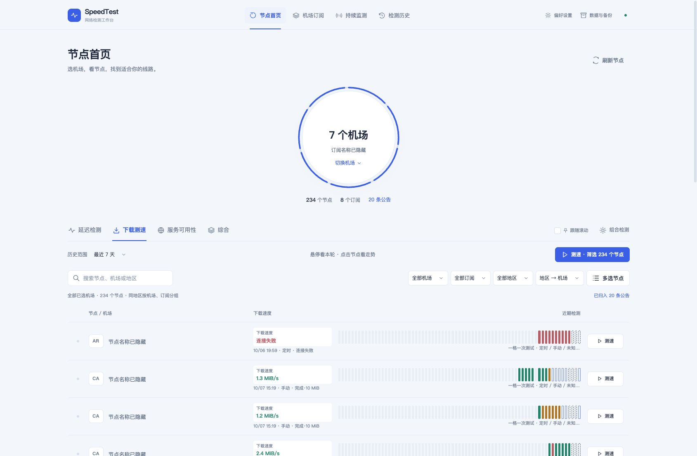
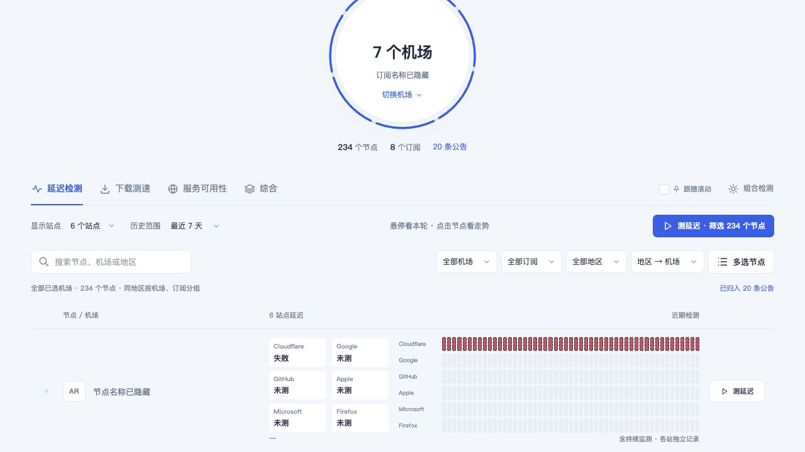
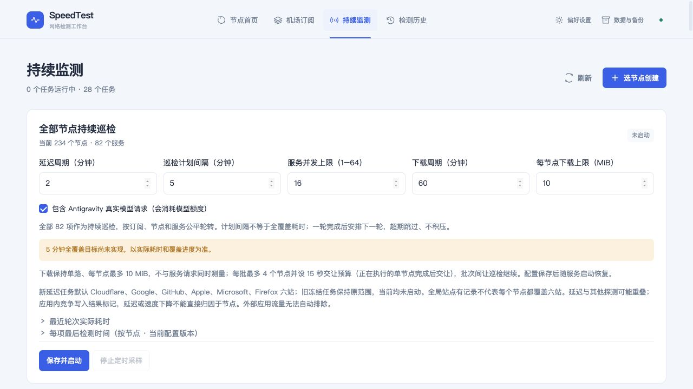

# Clash-SpeedTest

基于 Clash/Mihomo 的节点检测工具，以本地服务＋Web 界面管理订阅、检测延迟与下载、查看服务响应和历史。它帮助比较节点的实际检测记录，不替你自动切换系统代理，也不能仅凭网页打开就证明账号、模型、播放或地区解锁可用。

**状态：暂停功能开发，保留当前成果供未来继续。** 当前版本包含尚未完成的部分；此次收存没有追加实机验收或网络探测。源码、已有测试和文档保存到本地 Git；私有数据、运行程序及原始证据单独保存，未推送、发布或将远端仓库 Archived。后续工作从这一基线继续，不重放旧分支补丁。

## 当前界面

以下为 2026-10-07 本地运行界面的实际截图，订阅和节点名称已隐藏。只读取已有历史，没有为截图新增探测；截图中的旧结果不代表节点现在仍可用，也不作为新的验收证据。

**节点首页与下载历史**：保留现有监控条，一格一次测试，展示完成、失败和历史来源。



**六站延迟**：各站结果独立展示；未测保持未测，不能把已有 Cloudflare 记录当作六站全覆盖。



**巡检配置处于未启动状态**：保留 82 项目录、16 路服务上限和单路 10 MiB 下载；画面中的旧配置勾选不表示任务正在执行。五分钟全覆盖仍标为未实现。



## 怎样运行

使用本仓库 `suifracti/clash-speedtest` 的源码，不用上游的 `go install ...@latest` 代替此版本。需要 Git、Go 1.25+、Node.js/npm；依赖版本以 `go.mod`、`go.sum` 和 `frontend/package-lock.json` 为准。Mac 编译仍依赖 Wails 的 Darwin 系统库，需要 Xcode Command Line Tools 和 CGO，但日常入口是服务＋Web，不需要制作桌面壳。

```sh
git clone https://github.com/suifracti/clash-speedtest.git
cd clash-speedtest
# 远端尚不包含此次本地暂停提交；恢复该提交请使用私有交付中的 Git bundle。
node scripts/prepare-legacy-assets.mjs
(cd frontend && npm ci && npm run build)
CGO_ENABLED=1 go build -buildvcs=false -o ./build/bin/clash-speedtest .
./build/bin/clash-speedtest --web --listen 127.0.0.1 --port 18474 \
  --browser none --no-auto-credentials \
  --data-dir "$HOME/Library/Application Support/ClashSpeedTest-Local"
```

打开 <http://127.0.0.1:18474/>。也可在完成前端构建后用 `bash ./run-web.sh`，并传入相同的 `--data-dir` 等参数。不要对同一数据目录同时启动两个服务。端口已占用时先确认现有进程；正常退出用 Ctrl+C，已有系统托管进程的停启方式以本机恢复说明为准。

前端生产资源通过 Go 嵌入，修改前端后须重新构建前端和服务。`prepare-legacy-assets.mjs` 只准备历史 GUI 包编译所需的三个资源，不替换当前界面；完整 Git 历史包含所需对象，浅克隆缺对象时见 [原迁移资源说明](docs/migration-extras.md)。原 CLI 仍保留，参数请查看 `./build/bin/clash-speedtest -h`；旧 CLI 和 Web 检测路径的结论不能混为同一方法。

数据目录必须明确：`--data-dir <绝对路径>` 优先于 `CLASH_SPEEDTEST_DATA_DIR`，默认路径会随平台和启动方式变化。显式目录是一套独立数据，不会自动合并其他目录的订阅或历史。`--no-auto-credentials` 关闭自动凭据发现；需要鉴权的检测应通过正常登录流程处理，不复制令牌。

## 目前可以使用什么

- **订阅与节点管理**：读取已有订阅和配置，按机场、地区、节点筛选，保留节点稳定身份和配置版本；公告排除与真实删除分开处理。
- **六站延迟**：新手动批量与新定时配置默认覆盖 Cloudflare、Google、GitHub、Apple、Microsoft、Firefox。每个节点一轮对应一格，格内保留独立站点结果、时间和原因；全局六站有记录不代表每个节点都已覆盖六站。旧冻结任务和历史不自动改范围。
- **下载测量**：Web 有界下载默认单路、每节点最多 10 MiB；读满显示“完成·10 MiB”，部分读取后到时限保留字节数、持续时间和部分结果。记录下载源、方法、读取上限、阶段、HTTP 状态、结束原因及可取得的出口条件；不同条件不能直接混成同一速度趋势。
- **82 项服务目录**：可按节点选择服务，保留各项独立结论。HTTP 可达、验证挑战、HTTP 拒绝、超时、未确认、未执行分别展示；登录、播放、地区解锁和真实模型回答需要对应业务证据。Antigravity 的现有鉴权模型探针可能消耗额度，不应把它作为高频全节点默认检测。
- **历史和监控格**：同轮子结果合入同一格，持久轮次与手动／定时来源分开；保存重试不增加测试次数。缺少关联的旧历史保持未知，不按近似时间强拼。已有父记录能证明的目标归属继续保留。
- **现有 Web 界面**：保留悬停预览、点击固定详情、历史分页、趋势、缓存和可见区域渲染。悬停格时显示该次速度／时间／状态，移出普通预览后恢复最新记录；固定详情需主动关闭。
- **定时能力保留但当前全部关闭**：包括周期采样、旧监控任务的启动恢复、订阅周期刷新和每日更新。服务进程运行不等于检测任务正在运行。不要点“保存并启动”来验证恢复；旧受限任务整项不启动，缺失节点应查看完整清单，不自动改范围或删除任务。

服务并发保留 16 路，下载保留单路 10 MiB。旧任务是冻结范围，当前全量巡检使用当前节点范围，不能让两者看起来都在运行。日常重点 GPT／Grok 的 12 节点优先复查池仅作为私有方案保留，持续检测计划未启用。

## 未完成与已知问题

1. **全量耗时与调度**：六站全节点耗时未验；82 项全目录的五分钟全覆盖未实现。16 路是上限，不代表持续活跃 16 路。排队、下载互斥、网络、保存及中断计时有观测边界，重叠的工作槽位秒不能直接相加当墙钟时间。少量快速样本不代表全目录吞吐。
2. **A/B 结论受限**：已授权的一次固定对照在 A 臂遇下载源 HTTP 429 后停止，B 臂没有运行；无法判断补位是否提速，不自动重跑。下载慢保存分支可能过早释放批次，取消与终态竞争也可能使周期汇总少计已保存项，尚未修复。
3. **真实可用性**：ChatGPT 网页 HTTP 成功不证明 GPT CLI 认证或指定模型回答；Grok HTTP 探针观察不到挑战也不保证普通浏览器不弹 Cloudflare。既有 Antigravity 模型证据只代表该次节点、凭据和实际模型，不证明所有模型可用。CLI 认证和模型额度方向停止扩展；持续检测范围与预算仍需未来单独决定。
4. **下载源及出口**：当前源仍可能拒绝或限流；429 单列为测速源限流，保留 Retry-After 与有界冷却，不能立即重试。Mac 下载增加物理接口／DNS／socket 验证路径，验证失败不静默退回套层代理，但不能承诺所有协议、外部 TUN、路由或服务探针都已完成出口验证。取消、未执行、保存失败不是节点故障。
5. **历史、排序与恢复**：旧数据可能没有轮次、触发来源或完整阶段。最近延迟排序仍未统一全部监测 RTT，指标排序仍受历史加载范围影响；真实保存失败后的完整 UI 重试和鉴权生命周期未完成验收。启动恢复会将遗留 saving 状态转成 failed，不能当作新网络失败。
6. **长时间使用**：已有缓存／可见区域优化和有限浏览证据，不能宣称数小时、跨日、24 小时常驻或内存长期无泄漏已通过。每日用量跨日、漏采和计数重置仍有未验边界；进程退出、机器睡眠期间不保证采样。

更简短的继续入口与边界见 [暂停开发记录](docs/development-paused-20261007.md)。历史 Windows／Mac 迁移文档是当时的记录，以本页和暂停记录描述的当前状态为准。

## 怎样恢复或以后继续

恢复需要三类材料：**本地 Git 提交／bundle、对应运行程序和前端资源、私有数据快照**。具体提交 SHA、程序 SHA-256、原始证据位置、未提交文件清单和启动命令保存在私有暂停恢复目录，避免公开个人路径、订阅和节点信息。

1. 在新独立目录从 bundle 恢复源码并核对提交 SHA；保留旧 checkout，不重置它，也不重放历史整包补丁。
2. 校验运行包 SHA-256。可复用已保存程序与嵌入资源；重新构建时按上面的步骤使用同一源码和锁文件，Mac 已有工具链／缓存可离线使用。
3. 将私有状态快照解到新数据目录。数据库使用 SQLite backup API 的一致快照，不将活动 WAL／SHM 当恢复源；不要覆盖本机更新的个人数据，同一数据库不能由两台机器同时写入。
4. 启动前核对周期 enabled=false、任务 resume_on_launch=false、订阅周期刷新关闭、每日更新关闭。旧快照不自动用于恢复启动意图；使用 `--no-auto-credentials`，正常登录另行处理。
5. 此基线按只读约定保存；未来继续先明确任务和范围，再从新分支／独立目录工作。只读是协作约定，不修改文件或系统权限。本次未安装、修改或安排自动任务。

## 哪些内容不进入 Git

订阅地址、节点密码／密钥、账号凭据、OAuth 令牌、个人配置、运行数据库、敏感日志、原始截图与实测证据不属于公开源码。按 `.gitignore` 保留在私有目录；前端产物、旧嵌入资源、二进制和依赖目录也不提交，分别用运行包、历史资源和锁文件恢复。不要把“所有成果本地提交”理解为 `git add -f` 私人内容。

代码仍包含已有离线测试，便于未来有明确授权时继续检查；本次收存不运行新增实验，也不用测试数量替代功能完成说明。
